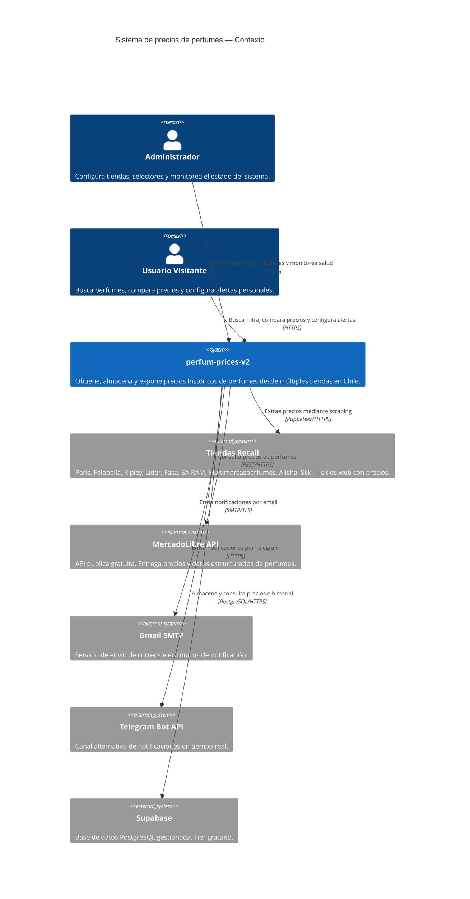
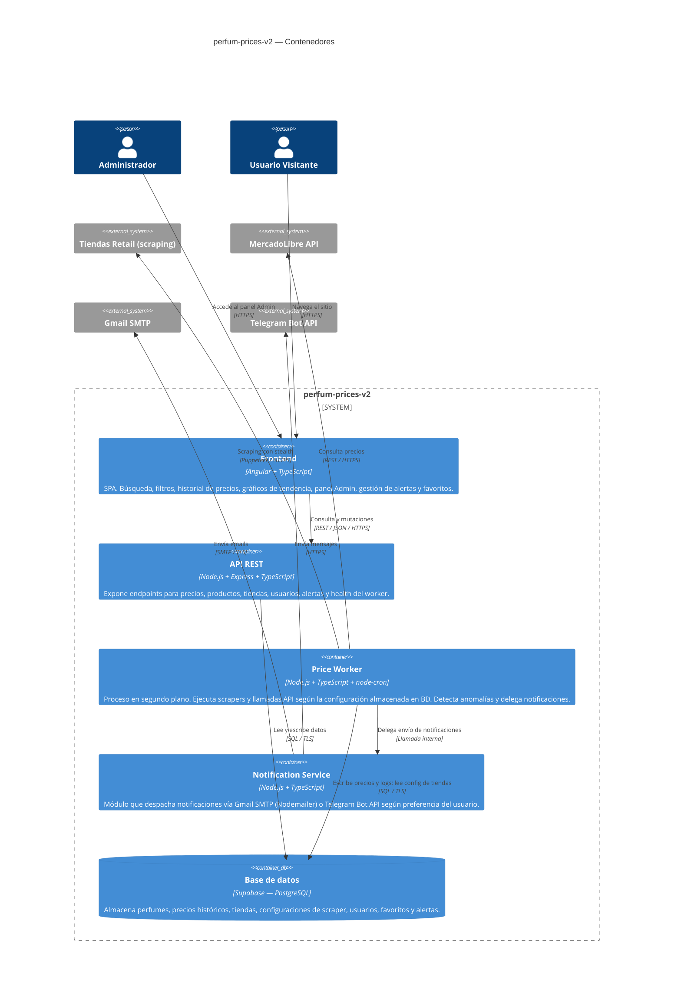
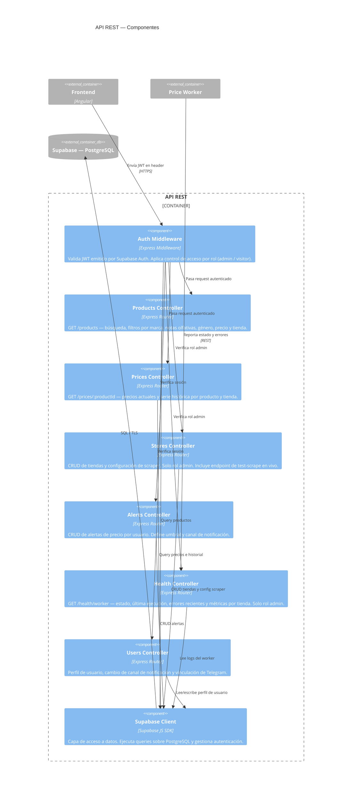
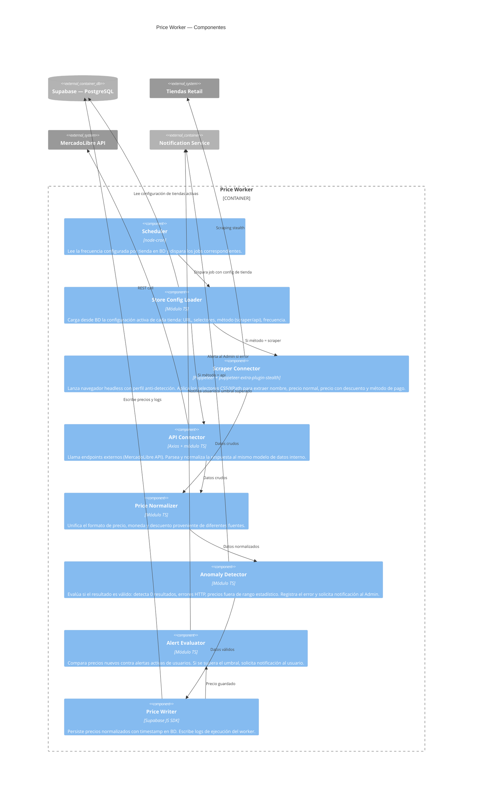
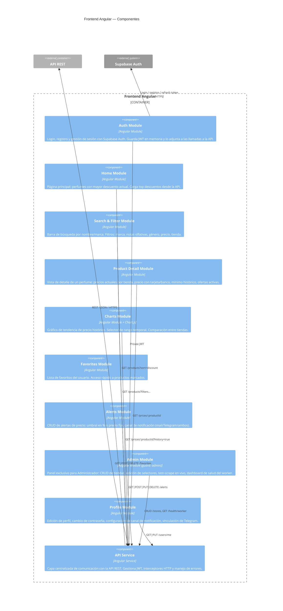

# Diagrama C4 — perfum-prices-v2

> Niveles 1, 2 y 3 documentados aquí.
> El Nivel 4 (código) se completará una vez que exista implementación.

---

## Nivel 1 — Contexto del sistema

Muestra el sistema como una caja negra y sus relaciones con usuarios y sistemas externos.

---

## Nivel 2 — Contenedores

Muestra los procesos ejecutables, almacenes de datos y cómo se comunican entre sí.

---

## Nivel 3 — Componentes

### 3.1 API REST

---

### 3.2 Price Worker

---

### 3.3 Frontend (Angular)

---

## Nivel 4 — Código

> Pendiente. Se completará una vez que exista implementación en el repositorio.
> Documentará clases, interfaces y relaciones internas de cada componente clave.
