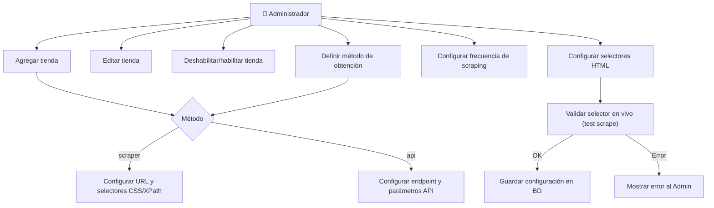
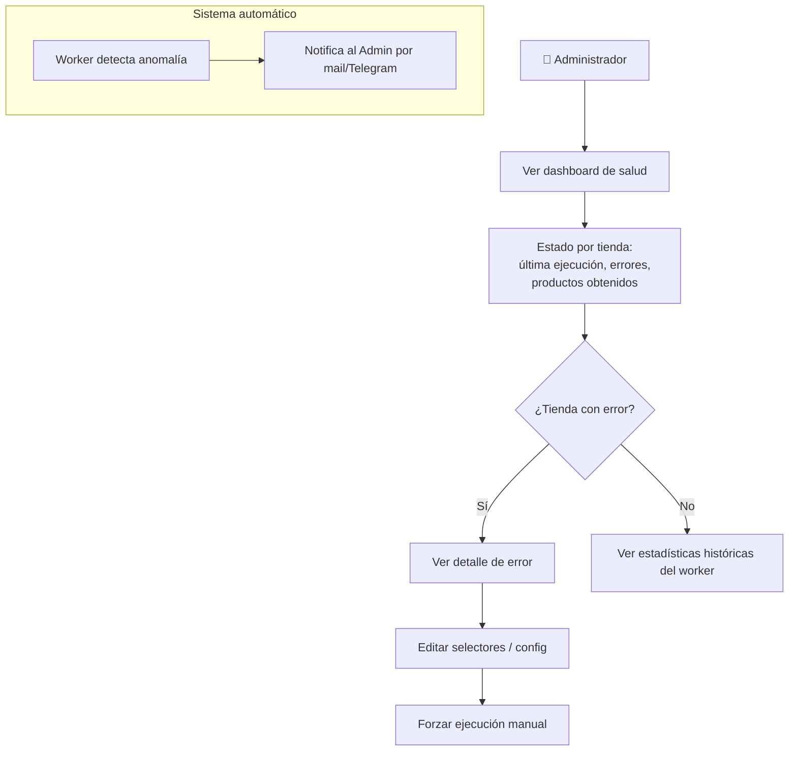
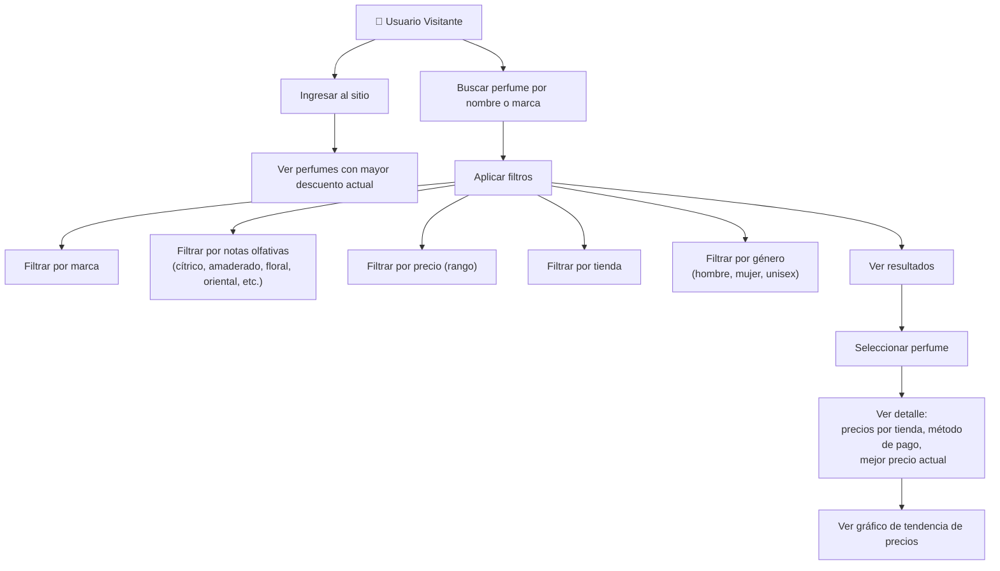
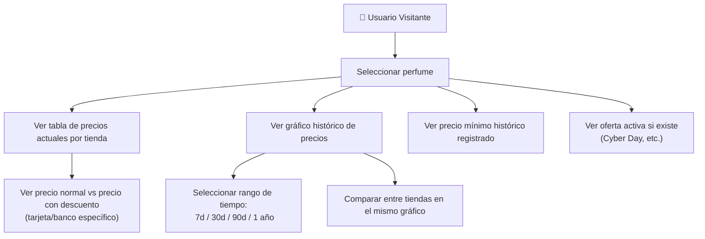
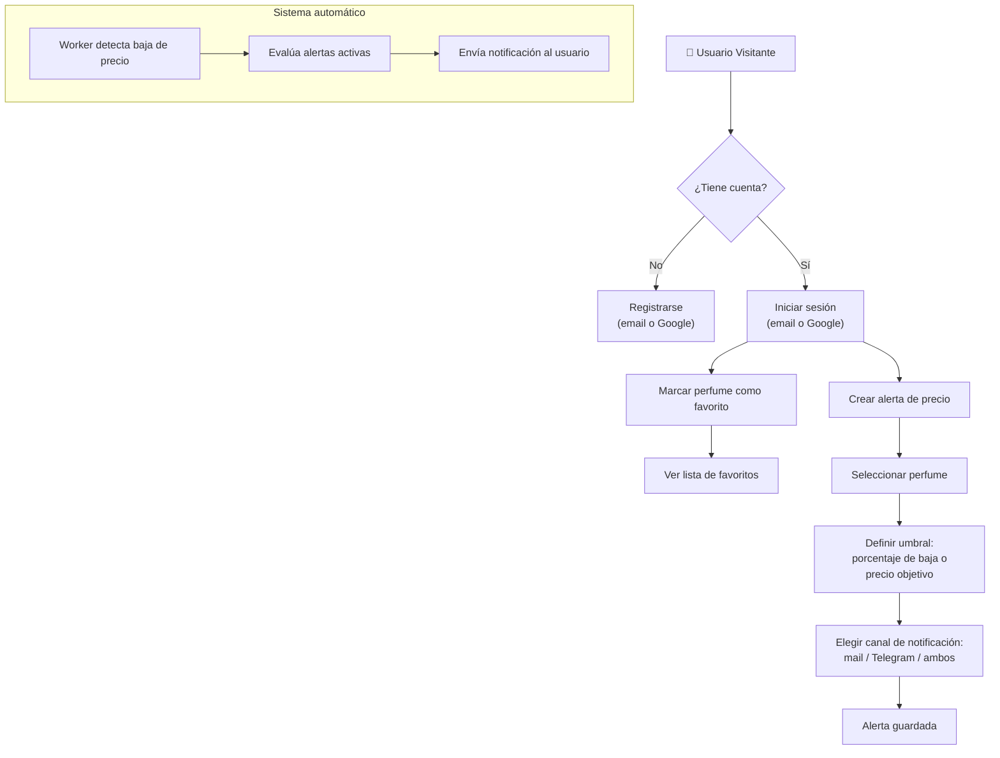
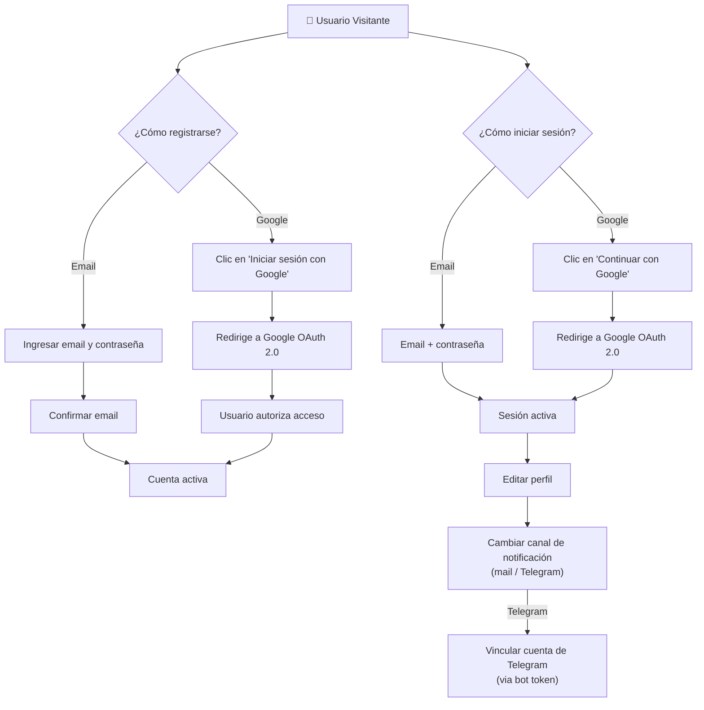
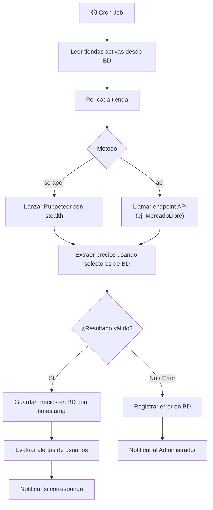

# Casos de Uso — perfum-prices-v2

## UC-01: Vista general del sistema

```mermaid
graph TB
    Admin["👤 Administrador"]
    Visitor["👤 Usuario Visitante"]
    Worker["⚙️ Worker (sistema)"]
    NotifService["📨 Servicio de Notificaciones"]

    subgraph Web["Aplicación Web"]
        UC_AdminStores["Gestionar tiendas"]
        UC_AdminHealth["Ver salud del scraper"]
        UC_AdminUsers["Gestionar usuarios"]
        UC_Search["Buscar perfumes"]
        UC_Filter["Filtrar resultados"]
        UC_History["Ver historial de precios"]
        UC_Favorites["Gestionar favoritos"]
        UC_Alerts["Configurar alertas de precio"]
        UC_Trends["Ver gráficos de tendencia"]
    end

    subgraph Background["Procesos en segundo plano"]
        UC_Scrape["Obtener precios (scraper/API)"]
        UC_Detect["Detectar anomalías"]
        UC_Notify["Enviar notificaciones"]
    end

    Admin --> UC_AdminStores
    Admin --> UC_AdminHealth
    Admin --> UC_AdminUsers
    Admin --> UC_Search
    Admin --> UC_Filter

    Visitor --> UC_Search
    Visitor --> UC_Filter
    Visitor --> UC_History
    Visitor --> UC_Favorites
    Visitor --> UC_Alerts
    Visitor --> UC_Trends

    Worker --> UC_Scrape
    Worker --> UC_Detect
    Worker --> UC_Notify

    UC_Notify --> NotifService
    UC_Detect --> NotifService
```

---

## UC-02: Gestión de tiendas (Administrador)

---

## UC-03: Monitoreo y salud del worker (Administrador)

---

## UC-04: Búsqueda y exploración de perfumes (Visitante)

---

## UC-05: Historial y comparación de precios (Visitante)

---

## UC-06: Favoritos y alertas de precio (Visitante)

---

## UC-07: Registro y autenticación (Visitante)

---

## UC-08: Proceso automatizado de obtención de precios (Worker)

---

## Resumen de actores y casos de uso

| Actor | Casos de uso |
|---|---|
| **Administrador** | UC-02, UC-03 + todos los de Visitante |
| **Usuario Visitante** | UC-04, UC-05, UC-06, UC-07 |
| **Worker (sistema)** | UC-08 |
| **Servicio de Notificaciones** | Invocado por UC-06 y UC-08 |
