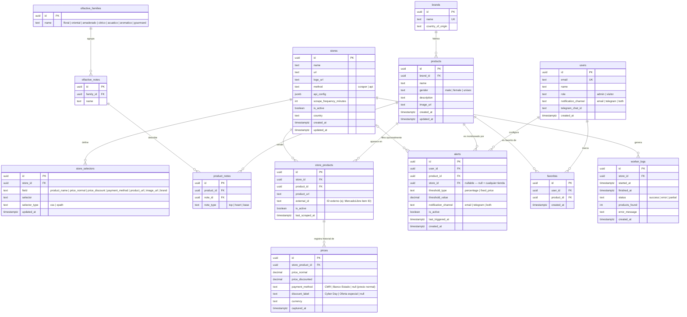

# Diagrama Entidad-Relación — perfum-prices-v2

---

## Diagrama completo

---

## Descripción de entidades

### `users`
Usuarios del sistema. El campo `role` determina si tiene acceso al panel Admin. `notification_channel` y `telegram_chat_id` configuran cómo recibe alertas.

### `stores`
Tiendas registradas. `method` define si se obtienen precios por scraping (`scraper`) o API (`api`). Para `api`, `api_config` almacena en JSON los parámetros del endpoint (url base, query params, headers). `scrape_frequency_minutes` es editable por el Admin.

### `store_selectors`
Selectores CSS o XPath por campo y por tienda. Permiten al Admin actualizar la extracción sin tocar código cuando la tienda cambia su estructura HTML.

### `brands`
Catálogo de marcas de perfumes (Chanel, Dior, Carolina Herrera, etc.).

### `olfactive_families`
Familias olfativas de agrupación: floral, oriental, amaderado, cítrico, acuático, aromático, gourmand.

### `olfactive_notes`
Notas individuales dentro de una familia (ej: rosa, jazmín dentro de floral). Usadas para filtros en el frontend.

### `products`
Perfumes normalizados. Un mismo perfume puede estar en varias tiendas; la relación con cada tienda se gestiona en `store_products`.

### `product_notes`
Relación N:M entre productos y notas olfativas. `note_type` indica si es nota de salida (top), corazón (heart) o fondo (base).

### `store_products`
Vínculo entre un producto y una tienda específica. Guarda la URL directa del producto en esa tienda y, si aplica, el ID externo (útil para MercadoLibre API). Es la unidad de scraping del worker.

### `prices`
Serie histórica de precios. Por cada ejecución del worker se inserta un registro con el precio capturado en ese momento. `payment_method` registra si el precio aplica a una tarjeta o banco específico. `discount_label` registra el nombre de la oferta (Cyber Day, etc.).

### `alerts`
Alertas configuradas por usuarios. `store_id` es nullable: si es null, la alerta aplica a cualquier tienda. `threshold_type` puede ser porcentaje de baja (`percentage`) o precio fijo objetivo (`fixed_price`).

### `favorites`
Lista de perfumes marcados por cada usuario para acceso rápido.

### `worker_logs`
Registro de cada ejecución del worker por tienda: cuándo inició, cuándo terminó, cuántos productos obtuvo, si hubo error. Alimenta el dashboard de salud del Admin.

---

## Notas de diseño

| Decisión | Razón |
|---|---|
| `store_selectors` en tabla separada | Permite actualizar selectores individuales por campo sin reemplazar toda la config de la tienda |
| `store_products` como entidad propia | Un producto existe una sola vez en `products`; la URL y el ID externo son atributos de la relación tienda-producto |
| `prices` solo inserta, nunca actualiza | Preserva el historial completo para gráficos de tendencia |
| `alerts.store_id` nullable | Un usuario puede querer la alerta para la mejor oferta de cualquier tienda, no solo una |
| `api_config` como `jsonb` | Cada API tiene parámetros distintos; un esquema flexible evita columnas vacías |
