# Diagramas de Secuencia — perfum-prices-v2

---

## SD-01: Autenticación con email y contraseña

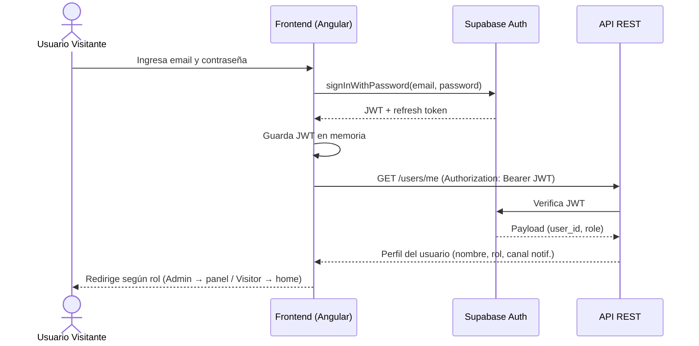

---

## SD-02: Autenticación con Google OAuth 2.0

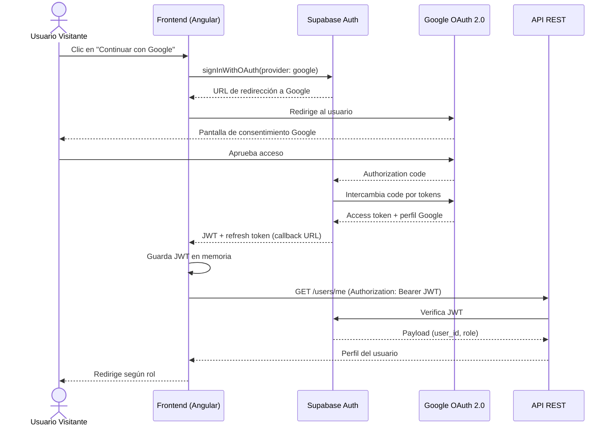

---

## SD-03: Búsqueda y filtrado de perfumes

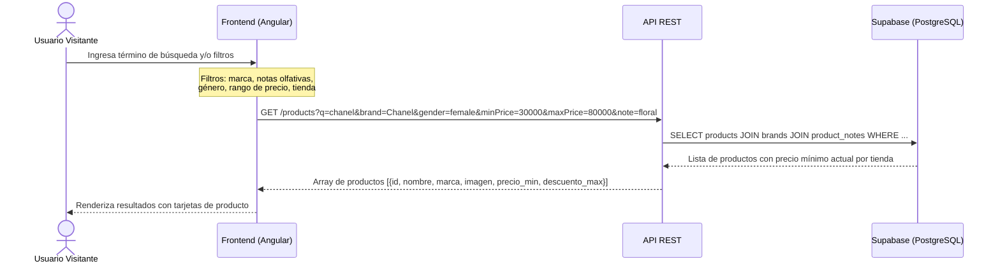

---

## SD-04: Ver detalle de perfume e historial de precios

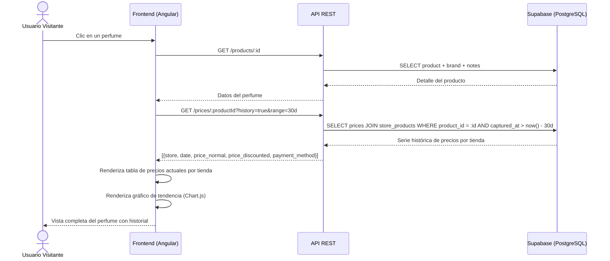

---

## SD-05: Configurar alerta de precio

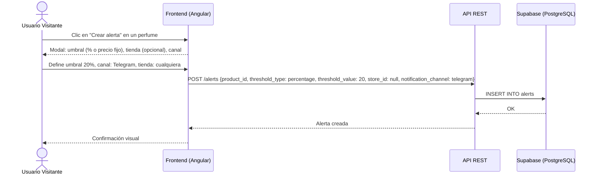

---

## SD-06: Worker — Obtención de precios por scraping

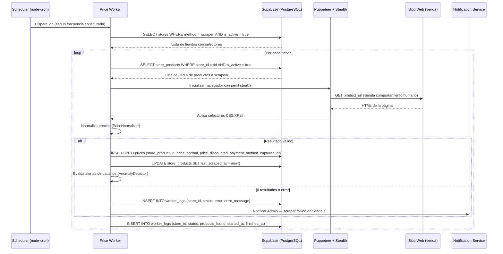

---

## SD-07: Worker — Obtención de precios por API (MercadoLibre)

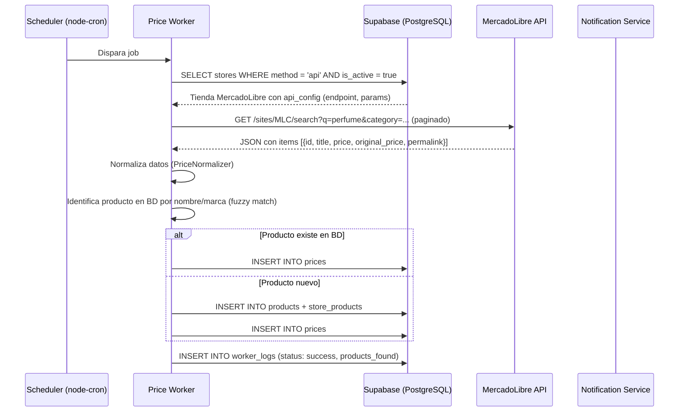

---

## SD-08: Worker — Detección de anomalía y notificación al Admin

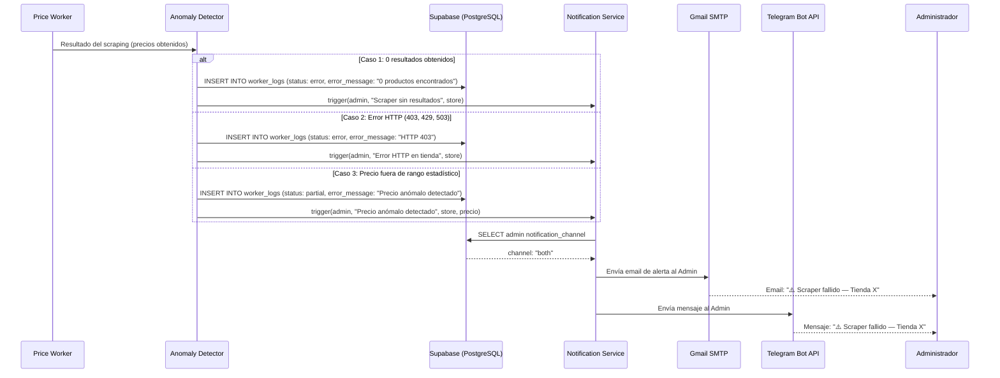

---

## SD-09: Worker — Evaluación de alertas de usuario y notificación

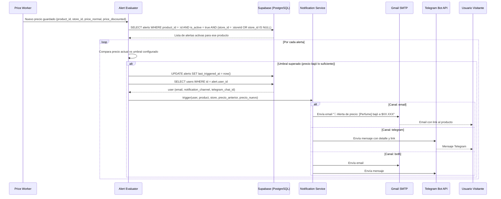

---

## SD-10: Admin — Agregar nueva tienda con test de selectores

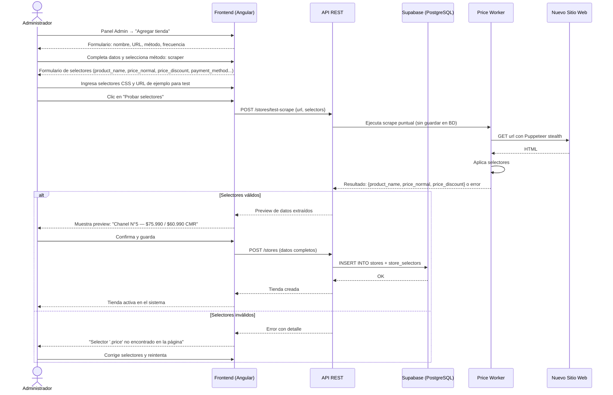

---

## SD-11: Admin — Actualizar selectores tras cambio de HTML

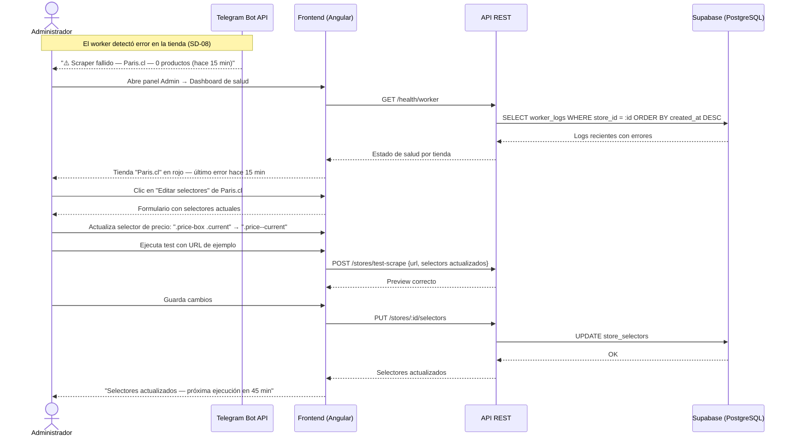

---

## Resumen de diagramas

| # | Flujo | Actores |
|---|---|---|
| SD-01 | Login con email/contraseña | Visitante, Frontend, Supabase, API |
| SD-02 | Login con Google OAuth 2.0 | Visitante, Frontend, Supabase, Google |
| SD-03 | Búsqueda y filtrado de perfumes | Visitante, Frontend, API, BD |
| SD-04 | Detalle de perfume e historial de precios | Visitante, Frontend, API, BD |
| SD-05 | Configurar alerta de precio | Visitante, Frontend, API, BD |
| SD-06 | Worker — scraping de precios | Worker, Puppeteer, Tienda, BD, Notif |
| SD-07 | Worker — obtención via API (MercadoLibre) | Worker, ML API, BD |
| SD-08 | Worker — anomalía y notificación al Admin | Worker, Detector, BD, Notif, Admin |
| SD-09 | Worker — alerta de precio a usuario | Worker, Evaluator, BD, Notif, Visitante |
| SD-10 | Admin — agregar tienda con test de selectores | Admin, Frontend, API, Worker, Sitio |
| SD-11 | Admin — actualizar selectores tras cambio HTML | Admin, Telegram, Frontend, API, BD |
